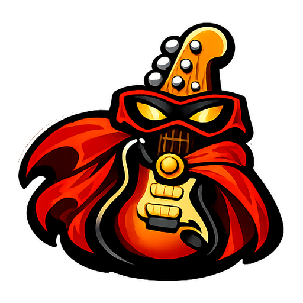

<div align="center">



# Clone Sidekick

**Browse, preview, and download custom charts for [Clone Hero](https://clonehero.net) - straight from the couch.**

Search the entire [Enchor.us](https://enchor.us) library, preview charts in-browser, and install songs directly into your Clone Hero songs folder. No more manual ZIP wrangling.

[](https://www.gnu.org/licenses/gpl-3.0) [](https://nodejs.org) [](https://react.dev) [](https://www.typescriptlang.org)

[](https://ko-fi.com/X7X51XJ8RG)

</div>

---

## 📖 What is Clone Sidekick?

Clone Sidekick is a self-hosted web app that runs on your PC (or a server) and gives you a browser-based interface to find and install custom charts for **Clone Hero**. Open it on your phone, tablet, Steam Deck browser, or any device on your network - search for a song, tap download, and it lands in your songs folder automatically. Then you just rescan in Clone Hero and rock out.

It's perfect for couch sessions where you don't want to alt-tab out of Clone Hero to hunt for songs.

> Basically, my wife wanted to play Clone Hero from the couch and not get up to download songs. She wanted to be able to add them from her phone while we were playing. So I built Clone Sidekick to solve that problem. Now she can even add songs when she hears them out of the house (e.g. on the radio) and have them ready to play when she gets home.

### 🎸 Preview
<div align="center">

</div>

### 🔑 Key Highlights

|    | Feature                     | Description                                              |
|----|:----------------------------|:---------------------------------------------------------|
| 🔍 | **Full Enchor.us Search**   | Simple keyword search or 25+ advanced filters            |
| 🎵 | **In-Browser Chart Preview**| Listen to and watch chart highways before downloading     |
| ⬇️ | **One-Tap Downloads**       | Queue songs and they appear in your Clone Hero folder    |
| 📱 | **Use Any Device**          | Responsive UI works on phones, tablets, and desktops     |
| 🌐 | **Optional Remote Access**  | Cloudflare Tunnel support for secure access from anywhere|
| 🔐 | **Google OAuth**            | Lock it down to specific Google accounts for WAN use     |
| 🧹 | **Auto Metadata Cleanup**   | Strips charter tags and rich-text markup from song metadata|
| 📡 | **Real-Time Progress**      | Live download status via Server-Sent Events              |

---

## ✨ Features

### 🔍 Search & Discovery

<table>
<tr>
<td width="50%">

**Simple Search**
- Keyword search across the entire Enchor.us database
- Filter by instrument (Guitar, Bass, Drums, Keys, GHL variants)
- Filter by difficulty (Easy, Medium, Hard, Expert)
- "Full EMHX" mode - only show charts with all 4 difficulties
- Infinite scroll with automatic pagination

</td>
<td width="50%">

**Advanced Search**
- Text filters with exact match & exclude toggles for Name, Artist, Album, Genre, Year, Charter
- Numeric ranges for Length, Intensity, Average NPS, Max NPS, Year
- Date filter (Modified After)
- Feature toggles: Forced Notes, Open Notes, Tap Notes, Solo Sections, Lyrics, Vocals, Roll Lanes, 2x Kick, Issues, Video Background, Modchart
- Sort by name, artist, album, genre, year, charter, length, or modified date

</td>
</tr>
</table>

### 🎵 Chart Cards

Every search result shows rich metadata at a glance:

- 🖼️ **Album art** from the Enchor.us CDN
- 🎤 **Song info** - name, artist, album, charter, genre, year, duration
- 🎸 **Instrument badges** with **E/M/H/X difficulty pills** showing which difficulties are charted
- 📊 **Expandable details** - note counts per instrument/difficulty, feature grid (solo sections, lyrics, forced notes, etc.), loading phrases, modification dates
- ▶️ **Chart preview player** - plays a 30-second audio preview with a scrolling note highway, selectable instrument and difficulty

### ⬇️ Download Manager

- **Queue system** - download multiple charts back-to-back
- **Real-time progress** - live percentage bar during download, status icons for each phase (⏳ Queued → ⬇️ Downloading → 📦 Extracting → ✅ Done)
- **Two output formats:**
  - 📄 `.sng` - single packed file (smaller, modern format)
  - 📁 **Chart Folder** - extracted files (classic format)
- **Video backgrounds** - optionally download video backgrounds or skip them for smaller file sizes
- **Duplicate detection** - won't re-download charts already in your library
- **Sort & manage** - sort by newest, oldest, artist, song name, or status
- **Delete from disk** - remove downloaded songs directly from the UI (with confirmation)
- **Automatic metadata cleanup** - strips `(Charter Group)`, `[CSC]`, rich-text markup and other noise from `song.ini` fields
- **Persistent history** - download list survives server restarts
- **Library scanning** - on first run, scans your existing songs folder and populates the download list

### ⚙️ Settings

All settings can be changed after initial setup without restarting (except port):

- **Songs Directory** - path to your Clone Hero songs folder with verification
- **Download Format** - `.sng` file or extracted folder
- **Video Backgrounds** - toggle downloading video backgrounds
- **Authentication** - switch between no auth (LAN) and Google OAuth
- **Google OAuth** - Client ID, Client Secret, Callback URL, allowed email list
- **Cloudflare Tunnel** - enable/disable remote access with hostname configuration
- **Server Port** - custom port (requires restart)

### 🔐 Security

- **AES-256-GCM encryption** - Google OAuth credentials and session secret are encrypted at rest in `data/config.json`
- **Encryption key** stored separately in `data/.key` (gitignored)
- **Session-based auth** with 7-day expiry
- **Email whitelist** - restrict access to specific Google accounts
- **Atomic config writes** - temp file + rename prevents corruption on crash

---

## 🚀 Installation

### Prerequisites

- **[Node.js](https://nodejs.org/) 18** or later
- **[pnpm](https://pnpm.io/installation)** package manager
- **[Clone Hero](https://clonehero.net)** installed with a songs folder
- *(Optional)* **[cloudflared](https://developers.cloudflare.com/cloudflare-one/connections/connect-networks/downloads/)** for remote access

### Quick Start

```bash
# 1. Clone the repository
git clone https://github.com/Insanity404/clone-sidekick.git
cd clone-sidekick

# 2. Install dependencies
pnpm install

# 3. Build the client
pnpm run build

# 4. Start the server
pnpm start
```

Open **http://localhost:4440** in your browser. The setup wizard will guide you through configuration on first run.

### 🧙 Setup Wizard

On first launch, a 5-step wizard walks you through everything:

| Step                  | What It Does                                                                              |
|:----------------------|:------------------------------------------------------------------------------------------|
| 👋 **Welcome**        | Overview of what Clone Sidekick does                                                      |
| 📁 **Songs Folder**   | Set and verify your Clone Hero songs directory (auto-suggests the default path for your OS)|
| 🔐 **Authentication** | Choose "No Auth" for LAN-only or "Google OAuth" for remote/shared access                  |
| 🌐 **Remote Access**  | Enable Cloudflare Tunnel for secure internet access (optional)                            |
| ✅ **Finish**          | Review your settings and save                                                             |

---

## 🖥️ Auto-Start on Boot

Once Clone Sidekick is set up and working, you'll probably want it running automatically in the background so it's always ready.

### 🪟 Windows (Task Scheduler)

1. Press <kbd>Win</kbd> + <kbd>R</kbd>, type `taskschd.msc`, press Enter
2. Click **Create Basic Task…** in the right panel
3. **Name:** `Clone Sidekick`
4. **Trigger:** "When the computer starts" (or "When I log on")
5. **Action:** "Start a program"
6. **Program/script:** Path to your Node.js executable, e.g.:
   ```
   C:\Program Files\nodejs\node.exe
   ```
7. **Add arguments:**
   ```
   --import tsx src/server/index.ts
   ```
8. **Start in:** Your Clone Sidekick folder, e.g.:
   ```
   C:\Users\YourName\source\repos\clone-sidekick
   ```
9. Check **"Open the Properties dialog…"** → Finish
10. In Properties: check **"Run whether user is logged on or not"** and **"Run with highest privileges"**

> 💡 **Tip:** You can also create a batch file and point Task Scheduler at it:
> ```batch
> @echo off
> cd /d "C:\Users\YourName\source\repos\clone-sidekick"
> pnpm start
> ```

### 🐧 Linux (systemd)

Create a service file at `/etc/systemd/system/clone-sidekick.service`:

```ini
[Unit]
Description=Clone Sidekick
After=network.target

[Service]
Type=simple
User=your-username
WorkingDirectory=/home/your-username/clone-sidekick
ExecStart=/usr/bin/node --import tsx src/server/index.ts
Restart=on-failure
RestartSec=5
Environment=NODE_ENV=production

[Install]
WantedBy=multi-user.target
```

Then enable and start:

```bash
sudo systemctl daemon-reload
sudo systemctl enable clone-sidekick
sudo systemctl start clone-sidekick

# Check status
sudo systemctl status clone-sidekick

# View logs
journalctl -u clone-sidekick -f
```

### 🍎 macOS (launchd)

Create `~/Library/LaunchAgents/com.clone-sidekick.plist`:

```xml
<?xml version="1.0" encoding="UTF-8"?>
<!DOCTYPE plist PUBLIC "-//Apple//DTD PLIST 1.0//EN"
  "http://www.apple.com/DTDs/PropertyList-1.0.dtd">
<plist version="1.0">
<dict>
    <key>Label</key>
    <string>com.clone-sidekick</string>
    <key>ProgramArguments</key>
    <array>
        <string>/usr/local/bin/node</string>
        <string>--import</string>
        <string>tsx</string>
        <string>src/server/index.ts</string>
    </array>
    <key>WorkingDirectory</key>
    <string>/Users/your-username/clone-sidekick</string>
    <key>RunAtLoad</key>
    <true/>
    <key>KeepAlive</key>
    <true/>
    <key>StandardOutPath</key>
    <string>/tmp/clone-sidekick.log</string>
    <key>StandardErrorPath</key>
    <string>/tmp/clone-sidekick.err</string>
</dict>
</plist>
```

Then load:

```bash
launchctl load ~/Library/LaunchAgents/com.clone-sidekick.plist

# To stop:
launchctl unload ~/Library/LaunchAgents/com.clone-sidekick.plist
```

---

## 🌐 Remote Access with Cloudflare Tunnel

Cloudflare Tunnel lets you securely expose Clone Sidekick to the internet without opening ports on your router. Traffic is encrypted end-to-end through Cloudflare's network.

### Setting Up the Tunnel

1. **Install cloudflared:** [Download here](https://developers.cloudflare.com/cloudflare-one/connections/connect-networks/downloads/)

2. **Authenticate with Cloudflare:**
   ```bash
   cloudflared tunnel login
   ```

3. **Enable the tunnel** in Clone Sidekick's setup wizard (or Settings → Remote Access) and enter your desired hostname (e.g., `guitar.example.com`)

4. Clone Sidekick will automatically create the tunnel and configure DNS routing.

### 🛡️ Securing Your Tunnel with Cloudflare Access

Since Clone Sidekick exposes your songs folder for downloads, it's **strongly recommended** to add a Cloudflare Access policy on top of the tunnel. This adds an authentication layer at Cloudflare's edge - before traffic even reaches your server.

#### Step 1: Create the Application

1. Go to the [Cloudflare Zero Trust Dashboard](https://one.dash.cloudflare.com/)
2. Navigate to **Access → Applications → Add an Application**
3. Choose **Self-hosted** and enter your tunnel hostname (e.g., `guitar.example.com`)
4. Give it a name like `Clone Sidekick`

#### Step 2: Add an Allow Policy with Email + Country Rules

Instead of only checking email addresses, you can **restrict access by geographic region** so that only people in your country (or state/region) can even attempt to authenticate. This blocks the vast majority of unwanted traffic before it reaches your login flow.

1. **Policy name:** `Clone Sidekick Access`
2. **Action:** Allow
3. **Configure rules:**

   | Rule Type   | Selector | Value                                |
   |:------------|:---------|:-------------------------------------|
   | **Include** | Emails   | Your allowed email addresses         |
   | **Require** | Country  | Your country code (e.g., `US`, `GB`) |

   The **Include** rule determines *who* can authenticate. The **Require** rule adds a mandatory condition — the visitor's IP must geolocate to the specified country *before* they're even shown the login page.

4. Save the policy

> 💡 **How it works:** A visitor from outside your country will receive an immediate block from Cloudflare's edge. They never see a login prompt, never reach your server, and never learn what's behind the domain. Only visitors from your region who *also* match an allowed email can get through.

#### What This Gives You

- ✅ **Geographic lockdown** - block all traffic originating outside your country/region
- ✅ **Email-based access control** - only specific Google accounts can authenticate
- ✅ **DDoS protection** at Cloudflare's edge
- ✅ **Audit logging** of who accessed your instance and when
- ✅ **No open ports** on your router - all traffic flows through Cloudflare

> 💡 **Defense in depth:** You can combine Cloudflare Access (country + email at the edge) **and** Clone Sidekick's built-in Google OAuth (application-level) for multiple layers of protection. An attacker would need to spoof their geographic location, pass Cloudflare's email check, *and* authenticate with a valid Google account.

### ⚠️ Important Considerations

- Your songs folder is accessible via the download/art endpoints - always use authentication when exposing to the internet
- Keep `cloudflared` updated for security patches
- Review the [Cloudflare Tunnel documentation](https://developers.cloudflare.com/cloudflare-one/connections/connect-networks/) for advanced configuration

---

## 🏗️ Architecture

```
┌──────────────────────────────────────────────────────────┐
│                      Browser (Any Device)                │
│  ┌──────────┐  ┌──────────────┐  ┌───────────────────┐   │
│  │  Search  │  │   Downloads  │  │     Settings      │   │
│  │  Panel   │  │    Queue     │  │      Panel        │   │
│  └────┬─────┘  └──────┬───────┘  └────────┬──────────┘   │
│       │               │                   │              │
│       └───────────────┼───────────────────┘              │
│                       │  React 19 + Tailwind CSS         │
└───────────────────────┼──────────────────────────────────┘
                        │ HTTP / SSE
┌───────────────────────┼──────────────────────────────────┐
│                Express Server (:4440)                    │
│  ┌────────────┐  ┌───────────┐  ┌─────────────────────┐  │
│  │  Search    │  │ Download  │  │   Config Store      │  │
│  │  Proxy     │  │ Manager   │  │  (AES-256-GCM)      │  │
│  └─────┬──────┘  └─────┬─────┘  └─────────────────────┘  │
│        │               │                                 │
│  ┌─────┴──────┐  ┌─────┴──────┐  ┌─────────────────────┐ │
│  │ Enchor.us  │  │ Songs Dir  │  │  Cloudflare Tunnel  │ │
│  │   API      │  │  (Extract) │  │  (cloudflared)      │ │
│  └────────────┘  └────────────┘  └─────────────────────┘ │
└──────────────────────────────────────────────────────────┘
```

### Tech Stack

| Layer               | Technology                                                                  |
|:--------------------|:----------------------------------------------------------------------------|
| **Frontend**        | React 19, Vite 8, Tailwind CSS 4, TypeScript 6                             |
| **Backend**         | Express 5, tsx, Node.js 18+                                                |
| **Auth**            | Passport.js with Google OAuth 2.0                                          |
| **Chart Data**      | [Enchor.us API](https://enchor.us)                                         |
| **Chart Preview**   | [chart-preview](https://www.npmjs.com/package/chart-preview) web component |
| **File Handling**   | parse-sng, yauzl-promise                                                   |
| **Tunnel**          | Cloudflare Tunnel (cloudflared)                                            |
| **Encryption**      | AES-256-GCM (Node.js crypto)                                              |

---

## 📁 Project Structure

```
clone-sidekick/
├── src/
│   ├── client/                  # React frontend
│   │   ├── components/
│   │   │   ├── SearchPanel.tsx      # Search interface (simple + advanced)
│   │   │   ├── ChartCard.tsx        # Chart result card with preview
│   │   │   ├── DownloadQueue.tsx    # Download manager & history
│   │   │   ├── SettingsPanel.tsx    # Settings page
│   │   │   ├── LoginGate.tsx        # OAuth login screen
│   │   │   └── Toast.tsx            # Shared toast notification system
│   │   ├── setup/
│   │   │   ├── SetupWizard.tsx      # First-run setup wizard
│   │   │   └── steps/              # Wizard steps (Welcome → Finish)
│   │   ├── api.ts                   # API client & SSE subscription
│   │   └── main.tsx                 # App entry point
│   ├── server/                  # Express backend
│   │   ├── index.ts                 # Server startup & middleware
│   │   ├── routes.ts                # API endpoints
│   │   ├── downloadManager.ts       # Download queue & extraction
│   │   ├── enchor.ts                # Enchor.us API client
│   │   ├── enrichment.ts            # Metadata enrichment for scanned songs
│   │   ├── configStore.ts           # Encrypted config management
│   │   ├── auth.ts                  # Google OAuth setup
│   │   ├── tunnel.ts                # Cloudflare Tunnel management
│   │   ├── persistence.ts           # Download history & songs dir scanning
│   │   └── songIniCleaner.ts        # Metadata tag cleanup
│   └── shared/
│       └── types.ts                 # Shared TypeScript types
├── data/                        # Runtime data (gitignored)
│   ├── config.json                  # Encrypted server config
│   ├── .key                         # Encryption key
│   └── downloads.json               # Download history
└── public/                      # Static assets
```

---

## 🤝 Contributing

Contributions are welcome! Feel free to open issues and pull requests.

1. Fork the repository
2. Create a feature branch (`git checkout -b feature/my-feature`)
3. Commit your changes (`git commit -am 'Add my feature'`)
4. Push to the branch (`git push origin feature/my-feature`)
5. Open a Pull Request

---

## 🙏 Acknowledgments

Clone Sidekick wouldn't exist without these amazing projects and communities:

- 🎮 **[Clone Hero](https://clonehero.net)** - The free rhythm game that started it all. Clone Sidekick is built entirely to enhance the Clone Hero experience.
- 🎵 **[Enchor.us](https://enchor.us)** - The incredible chart database and API that powers all of Clone Sidekick's search and download functionality. Huge thanks to the Enchor team for making chart discovery accessible.
- 🎸 **The Clone Hero Community** - The charters, players, and modders who keep the rhythm game spirit alive.
- ▶️ **[chart-preview](https://www.npmjs.com/package/chart-preview)** - The web component that makes in-browser chart previews possible.

---

## 📄 License

This project is licensed under the **GNU General Public License v3.0** - see the [LICENSE](LICENSE) file for details.

---

<div align="center">

**🎸 Rock on! 🎸**

*Made for the Clone Hero community with ❤️*

</div>
